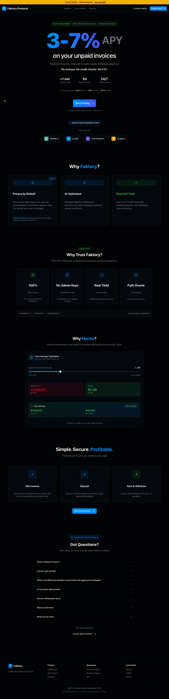
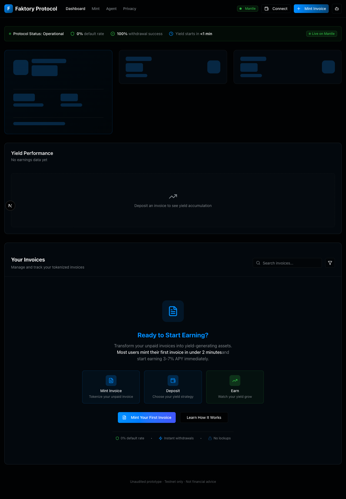
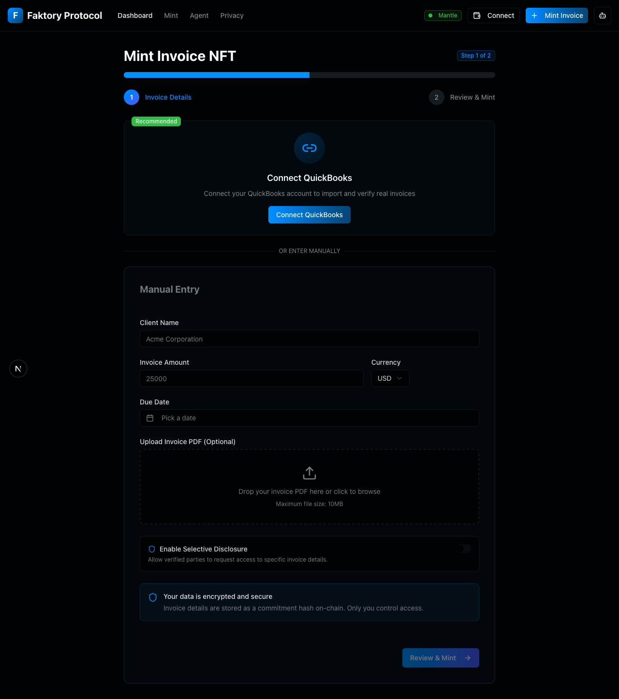
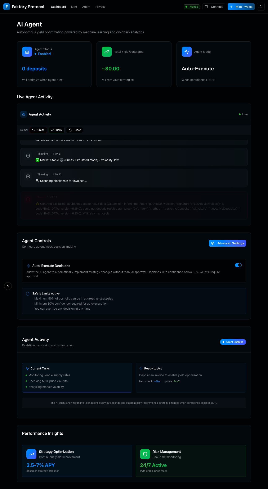

# Faktory Protocol - Demo Guide

> **For Hackathon Judges:** This 2-minute guide shows you exactly what Faktory does and how to test it.

**Live Demo:** https://faktory-app.vercel.app
**GitHub:** https://github.com/[your-username]/faktory

---

## What Is This?

Faktory lets crypto-native freelancers earn **3-7% APY** on unpaid invoices while waiting for clients to pay.

**Not invoice factoring** (we don't lend) — this is a **yield optimizer** for invoices you're already waiting on.

---

## Quick Demo Flow (2 Minutes)

### Prerequisites
- MetaMask installed
- Connected to **Mantle Sepolia** testnet
- ~0.1 MNT for gas ([Get from faucet](https://faucet.sepolia.mantle.xyz/))

### Step 1: Landing Page

**URL:** https://faktory-app.vercel.app



**What to notice:**
- Light theme (breaks from dark crypto UI cliché)
- Professional SaaS aesthetic (Stripe/Linear inspired)
- Clear value prop: "Earn 3-7% APY on unpaid invoices"
- Live yield rates displayed
- No overpromising (says "earn yield" not "get cash advance")

### Step 2: Connect Wallet

Click **"Get Started"** → Connect MetaMask

<!-- Wallet connection happens inline, no separate screenshot needed -->

**Network:** Mantle Sepolia (Chain ID: 5003)
**RPC:** https://rpc.sepolia.mantle.xyz

### Step 3: Dashboard (Empty State)

**URL:** https://faktory-app.vercel.app/dashboard



**What to notice:**
- Clean, Bloomberg Terminal aesthetic
- Portfolio cards: TVL, Total Yield, Active Invoices
- Empty state with clear CTA: "Mint Invoice"
- No jargon or crypto buzzwords

### Step 4: Mint an Invoice

Click **"Mint Invoice"**



**Fill in:**
- **Invoice Amount:** $10,000
- **Due Date:** 60 days from today
- **Payer:** (any name)
- **Strategy:** Conservative (3.5% APY) or Aggressive (7% APY)

**Click "Mint Invoice"** → Approve transaction in MetaMask

**What happens:**
1. Creates ERC721 NFT representing invoice
2. Stores invoice data as cryptographic hash (privacy)
3. Returns NFT to your wallet

### Step 5: Deposit to Vault

After minting, you'll see the deposit flow:

<!-- Deposit flow is part of mint process, shown in mint page screenshot -->

**Enter principal amount:** $10,000 (or less)

**Click "Deposit"** → Approve transaction

**What happens:**
1. Transfers NFT from wallet to YieldVault
2. Starts accruing yield based on chosen strategy
3. Updates invoice status to "InYield"

### Step 6: Dashboard (With Invoice)

Return to dashboard:


**What to notice:**
- Portfolio cards now show data
- Invoice table with live data:
  - Invoice ID
  - Amount
  - Due date
  - Strategy (Conservative/Aggressive)
  - APY rate
  - Accrued yield (updates in real-time)
  - Status badge (Active/InYield/Paid)
- Search functionality
- Click invoice → View details

### Step 7: Invoice Detail Page

Click any invoice in the table:

<!-- Invoice detail page - visit live demo to see full detail view -->

**What to notice:**
- Full invoice metadata
- Yield accrual chart
- Transaction history
- Withdraw button
- Strategy change option

### Step 8: Agent Interface

**URL:** https://faktory-app.vercel.app/dashboard/agent



**What to notice:**
- Live activity feed (WebSocket connection)
- Agent performance metrics
- Strategy recommendations with confidence scores
- Pause/Resume controls
- Real-time updates when agent analyzes invoices

**Note:** Agent service must be running locally:
```bash
cd agent && pnpm dev
```

See [agent/README.md](agent/README.md) for setup instructions.

---

## Testing Scenarios

### Scenario 1: Conservative Strategy
**Use case:** Invoice due in 30 days, want capital preservation

1. Mint invoice with due date = 30 days
2. Choose "Conservative" strategy
3. Deposit $5,000
4. Expected yield: ~$5,000 × 3.5% × (30/365) = **$14.38** in 30 days

### Scenario 2: Aggressive Strategy
**Use case:** Invoice due in 90 days, maximize yield

1. Mint invoice with due date = 90 days
2. Choose "Aggressive" strategy
3. Deposit $10,000
4. Expected yield: ~$10,000 × 7% × (90/365) = **$172.60** in 90 days

### Scenario 3: Agent Optimization
**Use case:** Let AI agent decide strategy

1. Mint multiple invoices with different due dates
2. Start agent service: `cd agent && pnpm dev`
3. Visit `/dashboard/agent`
4. Watch agent analyze and recommend strategies
5. High-confidence decisions (>70%) auto-execute

### Scenario 4: Withdrawal
**Use case:** Client paid, withdraw principal + yield

1. Go to invoice detail page
2. Click "Withdraw"
3. Approve transaction
4. Receive NFT back + accrued yield shown in dashboard

---

## Key Features to Highlight

### 1. Smart Contracts (Solidity + Foundry)

**Deployed on Mantle Sepolia:**
- `InvoiceNFT`: ERC721 with privacy commitments
- `YieldVault`: Deposit/withdraw + yield accrual
- `AgentRouter`: AI decision recording + execution

**View contracts:**
- [InvoiceNFT](https://sepolia.mantlescan.xyz/address/0xf35be6ffebf91acc27a78696cf912595c6b08aaa)
- [YieldVault](https://sepolia.mantlescan.xyz/address/0xd2cad31a080b0dae98d9d6427e500b50bcb92774)
- [AgentRouter](https://sepolia.mantlescan.xyz/address/0xede6db2855bacf191e5b2e2d91b6276bb56bf183)
- [MockOracle](https://sepolia.mantlescan.xyz/address/0xd0db0eb608107862e963737fe87ffdff7f400e3c)

### 2. Professional UI/UX

**Design System:**
- Light theme (not dark crypto UI)
- Stripe/Linear aesthetic
- Emerald-500 primary color
- Inter (UI) + JetBrains Mono (data)
- Generous whitespace
- No unnecessary emojis or AI slop

**Interactions:**
- Skeleton screens (not spinners)
- Optimistic UI where safe
- <100ms feedback on all actions
- Clear error messages with recovery paths

### 3. AI Agent (TypeScript + Claude)

**Features:**
- Autonomous monitoring (30s intervals)
- Claude AI reasoning for strategy decisions
- Confidence scoring (only executes >70%)
- WebSocket broadcasting to frontend
- Gas-aware execution

**Architecture:**
- Node.js service on port 8080
- Ethers.js for blockchain reads/writes
- Anthropic SDK for AI decisions
- WS server for real-time updates

### 4. Complete Stack

| Layer | Technology |
|-------|------------|
| Network | Mantle L2 (Sepolia testnet) |
| Smart Contracts | Solidity 0.8.24, Foundry |
| Frontend | Next.js 15, React 19, TypeScript |
| Styling | Tailwind CSS, custom design system |
| Blockchain Integration | wagmi, viem |
| Agent | TypeScript, Ethers.js, Claude AI |
| Real-time Updates | WebSocket |

---

## What's Real vs Simulated

### ✅ Fully Functional
- Smart contracts on Mantle Sepolia
- Wallet connection and transactions
- Invoice NFT minting
- Deposit/withdrawal flows
- Dashboard with real blockchain data
- Agent service and WebSocket API

### ⚠️ Simulated for Demo
- **Yields:** Hardcoded APY (3.5%/7%), not live Lendle integration
- **Risk scores:** Mock oracle, not real credit analysis
- **QuickBooks:** OAuth works but no data import

**Why?** See [README.md - Known Limitations](README.md#known-limitations-hackathon-prototype)

---

## Common Questions (Pre-answered)

### "Is this invoice factoring?"

**No.** Traditional factoring advances 80-90% cash upfront. We don't provide liquidity.

This is a **yield optimizer** for crypto-native freelancers who:
- Already have invoices
- Already use DeFi
- Want to earn yield while waiting for payment

### "Why not just use Lendle directly?"

**Valid question.** Value add:
1. **Better accounting** - Invoice NFTs track which yield came from which client
2. **Agent automation** - Auto-rebalances between Conservative/Aggressive
3. **Future composability** - NFTs can be traded, used as collateral

For single invoices, Lendle is simpler. For 10+ invoices, Faktory adds value.

### "How do you make money?"

**Honest answer:** We don't (yet). This is a hackathon prototype.

Production would need:
- Protocol fee on yields (0.5-1%)
- NFT marketplace trading fees
- Premium agent features

But unit economics aren't proven yet.

### "What's next after the hackathon?"

**If pursuing:**
1. User interviews (validate crypto-native freelancer demand)
2. Real Lendle integration
3. Smart contract audit ($30-50k)
4. Regulatory analysis (factoring is regulated)

**If not:**
- Great portfolio piece
- Technical learning experience
- Reference architecture for invoice tokenization

---

## Technical Deep Dive (For Judges)

### Architecture Overview

```
┌─────────────────────────────────────────────────────────────┐
│  Frontend (Next.js)                                         │
│  ├─ Landing page                                            │
│  ├─ Dashboard (wagmi hooks → blockchain)                    │
│  ├─ Mint flow (wallet signing)                              │
│  └─ Agent interface (WebSocket client)                      │
└─────────────────────────────────────────────────────────────┘
                          │
                          ↓
┌─────────────────────────────────────────────────────────────┐
│  Smart Contracts (Mantle Sepolia)                           │
│  ├─ InvoiceNFT.sol (ERC721 + privacy commitments)           │
│  ├─ YieldVault.sol (Deposit/withdraw + yield accrual)       │
│  └─ AgentRouter.sol (Decision recording + execution)        │
└─────────────────────────────────────────────────────────────┘
                          │
                          ↑
┌─────────────────────────────────────────────────────────────┐
│  Agent Service (Node.js)                                    │
│  ├─ Monitor vault (ethers.js reads)                         │
│  ├─ Analyze invoices (Claude AI)                            │
│  ├─ Record decisions (contract writes)                      │
│  └─ Broadcast updates (WebSocket)                           │
└─────────────────────────────────────────────────────────────┘
```

### Smart Contract Highlights

**InvoiceNFT.sol:**
```solidity
struct Invoice {
    bytes32 dataCommitment;      // keccak256(data + salt)
    bytes32 amountCommitment;    // For range proofs
    uint256 dueDate;
    address issuer;
    InvoiceStatus status;
    uint8 riskScore;             // 0-100
    uint8 paymentProbability;    // 0-100
}
```

**Privacy:** Invoice details stored as hashes, not plaintext.

**YieldVault.sol:**
```solidity
function deposit(uint256 tokenId, Strategy strategy, uint256 principal) {
    // Transfer NFT to vault
    // Start accruing yield
    // Update TVL
}

function _updateYield(uint256 tokenId) internal {
    uint256 yield = (principal * apy * timeElapsed) / (365 days * 10000);
    deposit.accruedYield += yield;
}
```

**Yield calculation:** Continuous compounding on-chain.

**AgentRouter.sol:**
```solidity
struct AgentDecision {
    Strategy recommendedStrategy;
    string reasoning;
    uint256 confidence;  // 0-100
    bool executed;
}
```

**Auto-execution:** If `confidence >= minConfidence && tx.gasprice <= maxGasPrice`

### 10-Tier Quality System

This project followed a **10-tier professional development process**:

1. ✅ **Scope Lock** - Product definition locked
2. ✅ **UX Flow** - 5-screen information architecture
3. ✅ **UI Design** - Dashboard-first light theme
4. ✅ **State Design** - Blockchain as source of truth
5. ✅ **API Contract** - 11 endpoints with clear contracts
6. ✅ **Performance** - <1s dashboard load, optimistic UI
7. ✅ **Error Handling** - 30 failure scenarios with recovery
8. ✅ **Security** - Trust boundaries, abuse resistance
9. ✅ **Code Quality** - 4-layer architecture, maintainability
10. ✅ **Shipping** - Quality gates, rollback plan

**Result:** Production-grade code quality (even if not production-ready product).

---

## Running Locally

### Prerequisites
- Node.js 18+
- pnpm
- MetaMask on Mantle Sepolia

### Frontend Only
```bash
git clone https://github.com/[your-username]/faktory
cd faktory
pnpm install
cd app && pnpm dev
```

Visit http://localhost:3000

### With Agent Service
```bash
# Terminal 1: Frontend
cd app && pnpm dev

# Terminal 2: Agent
cd agent
cp .env.example .env
# Edit .env with contract addresses (pre-filled)
pnpm dev
```

Agent runs on ws://localhost:8080

### With Smart Contracts (Local)
```bash
# Terminal 1: Anvil (local chain)
anvil

# Terminal 2: Deploy contracts
cd contracts
forge script script/Deploy.s.sol --rpc-url http://localhost:8545 --broadcast

# Terminal 3: Frontend (update env with new addresses)
cd app && pnpm dev
```

---

## Feedback & Questions

**Built for:** Mantle Global Hackathon 2025

**Questions?** Open an issue on GitHub

**Feedback appreciated:** This is a learning project, honest critiques welcome.

---

## License

MIT
